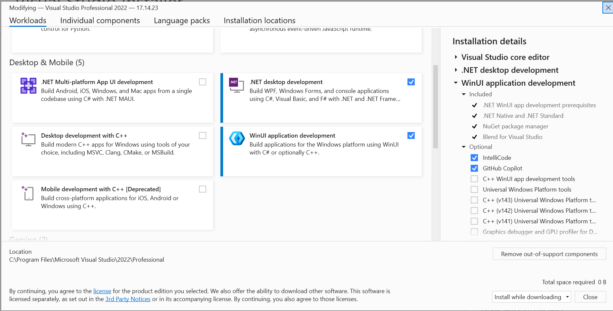

# Miku Push! Helpers

Helper application for more native experience on Windows 11 like share extension.

## Setup

1. [Download Visual Studio](https://visualstudio.microsoft.com/downloads/)

2. Install Visual Studio selecting the following workloads:
    - .NET desktop development workload
    - WinUI application development workload



## Build

Build for a specific platform. For example, for Windows x64

```powershell
dotnet build /p:Platform=x64
```

## Create a self-signed certificate

> ℹ️ You can skip create a new certificate if you already have one.
> You can check it executing this command: `Get-ChildItem Cert:\CurrentUser\My`.

```powershell
New-SelfSignedCertificate `
    -Type CodeSigningCert `
    -KeyUsage DigitalSignature `
    -CertStoreLocation "Cert:\CurrentUser\My" `
    -Subject "CN=Miku Push! Team, O=Miku Push! Team, C=ES" `
    -FriendlyName "Miku Push! Team"
```

Get the certificate thumbprint and save it in a variable.

```powershell
$thumbprint = Get-ChildItem Cert:\CurrentUser\My | Where-Object { $_.Subject -like "*Miku Push! Team*" } | Select-Object -ExpandProperty Thumbprint
```

Export the certificate as a PFX file.

```powershell
$password = ConvertTo-SecureString -String <Your Password> -Force -AsPlainText
Export-PfxCertificate -cert "Cert:\CurrentUser\My\$thumbprint" -FilePath MikuPushCert.pfx -Password $password
```

Trust exported certificate.

> ⚠️ You must run this command as Administrator.

```powershell
Import-PfxCertificate -FilePath MikuPushCert.pfx -CertStoreLocation Cert:\LocalMachine\TrustedPeople -Password $password
```

## Build signed MSIX package

```powershell
dotnet publish `
    -f net8.0-windows10.0.19041.0 `
    -c Release `
    -r win-x64 `
    --self-contained `
    -p:Platform=x64 `
    -p:GenerateAppxPackageOnBuild=true `
    -p:AppxPackageSigningEnabled=true `
    -p:PackageCertificateKeyFile="MikuPushCert.pfx" `
    -p:PackageCertificatePassword="<Your Password>"
```

## Build not signed MSIX package

> ⚠️ Installation will fail because it is not signed.
> You will need to sign before installing it.

```powershell
dotnet publish `
    -f net8.0-windows10.0.19041.0 `
    -c Release `
    -r win-x64 `
    --self-contained `
    -p:Platform=x64 `
    -p:GenerateAppxPackageOnBuild=true `
    -p:AppxPackageSigningEnabled=false
```

## Install MSIX package

The msixbundle will be generated in the `AppPackages\windows-helpers_*` folder.

```powershell
Add-AppxPackage -Path .\AppPackages\windows-helpers_*\windows-helpers_*.msixbundle
```
